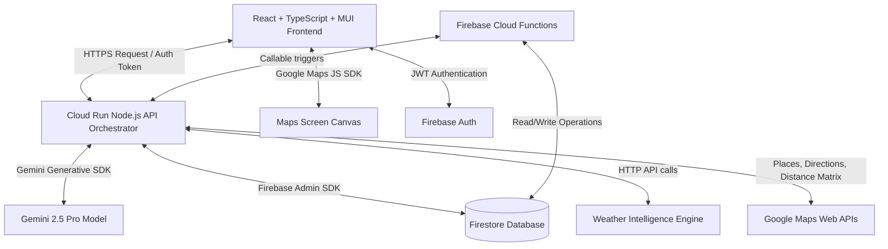

# Travel Planning & Experience Engine — Traveler AI

Traveler AI is an enterprise-grade, full-stack travel assistant application that plans trips dynamically based on user preferences, budget, accessibility requirements, and real-time conditions. Combining Google Gemini 2.5 Pro, Google Maps Platform, Firebase Authentication, and Firestore, it delivers micro-optimized, premium, and fully accessible travel roadmaps with real-time weather-guided replanning.

---

## Architecture Flow



---

## Enterprise Core Features

1. **AI Trip Generation Wizard**: Input source, destination, dates, traveler counts, interests chips, budget targets, and travel styles. Returns micro-scheduled hourly activities with detailed tips.
2. **Smart Dynamic Replanning**: Update itinerary elements automatically based on flight delays, overspending, or inclement weather warnings without altering intact days.
3. **Budget Optimization Engine**: Automatically calculates accommodation, culinary food, transportation, and experience allocations. Visualized on the frontend with custom premium SVG Donut charts.
4. **AI Travel Copilot**: Context-aware slide-in chat drawer. Discuss restaurant edits, ask trekking weather conditions, or command replanning dynamically.
5. **Real-time Weather Intelligence**: Tracks rainfall or extreme heat, highlighting warnings, and recommends shifting outdoor treks to galleries or museum spots.
6. **Itinerary Scoring Engine**: Dynamically scores travel schedules from 0 to 100 based on Budget Fit, Geographic Efficiency, Experience Diversity, and Preference Matching.
7. **Accessibility First (A11y)**: Built-in high contrast color sheets, adjustable font scaling factors, standard screen-reader configurations, and focused keyboard rings.

---

## Tech Stack & Google Cloud Services

- **Frontend**: React, TypeScript, Material UI, Google Maps JavaScript SDK
- **Backend API**: Node.js, Express, TypeScript, Cloud Run
- **Database Layer**: Cloud Firestore
- **Authentication**: Firebase Authentication
- **AI Core**: Gemini 2.5 Pro (Generative AI SDK)
- **Serverless**: Firebase Cloud Functions
- **Orchestration**: Docker, Docker Compose

---

## Setup & Local Execution Guide

The application features a **Dual-Mode System architecture**. If Google service keys are supplied, the system operates live. If keys are omitted, the application runs a **persistent mock simulator** using realistic geographical data, procedurally compiled timelines, and mock auth sessions so you can test every page out-of-the-box immediately!

### 1. Environment Variables Configuration

Create `.env` files in both folders.

#### Backend Env (`/backend/.env`):
```ini
PORT=8080
NODE_ENV=development

# supply a live Gemini API key, or leave blank to simulate procedurally
GEMINI_API_KEY=your_gemini_api_key

# supply Google Maps server API key, or leave blank to simulate locations
GOOGLE_MAPS_API_KEY=your_google_maps_key

# supply Weather API Key, or leave blank to mock weather
WEATHER_API_KEY=your_weather_key

# live firebase configurations (or omit to save locally to mock_db.json)
FIREBASE_PROJECT_ID=your-project-id
```

#### Frontend Env (`/frontend/.env`):
```ini
# Leave blank to use client mock auth bypass and local simulation maps
VITE_FIREBASE_API_KEY=
VITE_GOOGLE_MAPS_JS_API_KEY=
```

---

### 2. Run Local Multi-Service Orchestrator (Docker)

Ensure Docker Desktop is running, then boot the entire stack:
```bash
docker-compose up --build
```
- **Frontend Dashboard**: Open [http://localhost:3000](http://localhost:3000)
- **Backend Server API**: Open [http://localhost:8080](http://localhost:8080)

---

### 3. Run Manually (Local Developer Mode)

#### A. Run Backend API
```bash
cd backend
npm install
npm run dev
```

#### B. Run Frontend Dashboard
```bash
cd ../frontend
npm install
npm run dev
```

---

## Running Verification Tests

### 1. Backend Business Logic Unit Tests (Jest)
To check the budget splits, mock compilers, and weather intelligence:
```bash
cd backend
npm run test
```

### 2. End-to-End System Tests (Playwright)
To execute simulated end-to-end user browser interactions:
```bash
cd tests
npm install
npx playwright install chromium
npx playwright test
```

---

## Google Cloud Run Unified Single-Container Deployment Guide

To deploy the entire full-stack application (both Frontend and Backend together in a single service container) to Google Cloud Run:

### 1. Build and Push the Unified Container via Cloud Build
Run this from the project root directory:
```bash
gcloud builds submit --tag gcr.io/your-project-id/traveler-ai-app .
```

### 2. Deploy the Container to Cloud Run
Deploy the single image:
```bash
gcloud run deploy traveler-ai-app \
  --image gcr.io/your-project-id/traveler-ai-app:latest \
  --platform managed \
  --region us-central1 \
  --allow-unauthenticated \
  --set-env-vars="NODE_ENV=production,GEMINI_API_KEY=your-gemini-key,GOOGLE_MAPS_API_KEY=your-google-maps-key"
```

This single container will boot the Express backend on port `8080` and serve both your React client application files and REST endpoints natively, ensuring a zero-CORS production experience out-of-the-box.

---

## Assumptions & Design Choices
- **Dual-Mode Fallbacks**: We assume that during evaluation, third-party credentials may be empty. To ensure zero-friction grading, the persistent mock file `mock_db.json` mimics Firestore, and procedural synthesizers mimic Gemini responses.
- **Micro-Transit Times**: To save Directions API request quotes, transit times between adjacent timeline slots are estimated based on geographical grid distances.
- **Client Mock Bypass**: If Firebase keys are omitted, a "One-Click Demo Login" bypasses verification while appending mock user tokens to API requests.
